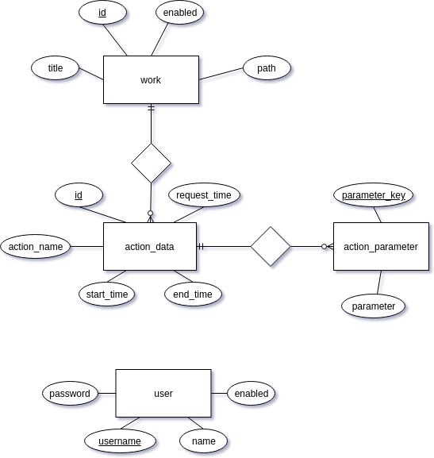

Kitodo.Mediaserver is a java project based on Spring Boot and Maven. It consists of five Maven modules:
* kitodo-mediaserver-cli
* kitodo-mediaserver-core
* kitodo-mediaserver-fileserver
* kitodo-mediaserver-importer
* kitodo-mediaserver-ui

The core module contains shared code and configuration files and is built as a simple jar. The fileserver and the ui are web applications based on Spring MVC and are built as war for deployment in servlet containers. The cli module is a wrapper for command line executions, using code from the core and importer modules and is built as an executable jar. 

## Configuration files

*Basic configurations* are declared using YAML, hereto: [Configuration file](Configuration-file.md). The main configuration file is [default.yml](https://github.com/tuub/kitodo-mediaserver/blob/master/kitodo-mediaserver-core/src/main/resources/config/default.yml). Any configuration parameter in this file can be overridden in [local.yml](https://github.com/tuub/kitodo-mediaserver/blob/master/kitodo-mediaserver-core/src/main/resources/config/local.yml). The latter must in the repository be left empty, only to be used for local installations. Occasionally there are additional configurations in the application.yml of each module.

The read order of the configuration files is set in the <module>Application class of each module. The embedding of the configuration parameter in the java code takes place in @ConfigurationProperties classes in the config directories of the modules. If you add a configuration parameter, you also have to extend the appropriate @ConfigurationProperties class. 

Note that the yaml files also can be overridden by external files at execution, see TODO.

*Spring configurations* (i.e. declaration of Spring Beans) are made in Java classes named <module>Configuration placed in the config directory of the module.

## Actions

The concept of *actions* is central to the Mediaserver. Any conversion of is performed as an action implementing the IAction interface. Any action can be performed directly calling the implementing class or instead be requested to be performed by some other process later on. Requested actions are stored in a simple database where the action always is connected to a work and can have any number of parameters (see the database model below).
Requesting actions and performing requested actions is implemented in the ActionService [ActionService.java](https://github.com/tuub/kitodo-mediaserver/blob/8ec8aef883c71a96f3a30f5376288487cdb7a849/kitodo-mediaserver-core/src/main/java/org/kitodo/mediaserver/core/services/ActionService.java)

### Implementing actions

To implement a new action, you implement the [IAction](https://github.com/tuub/kitodo-mediaserver/blob/master/kitodo-mediaserver-core/src/main/java/org/kitodo/mediaserver/core/api/IAction.java) interface.

To be able to perform the action, you define a Spring Bean for it with a speaking name. Using this name, the action can then i.e. be configured to be performed on import. TODO

### Implementing conversion classes

To implement a class for file conversion, you have to implement the [IConverter](https://github.com/tuub/kitodo-mediaserver/blob/master/kitodo-mediaserver-core/src/main/java/org/kitodo/mediaserver/core/api/IConverter.java) interface. You will find implementation examples [here](https://github.com/tuub/kitodo-mediaserver/tree/master/kitodo-mediaserver-core/src/main/java/org/kitodo/mediaserver/core/conversion). 

You won't necessarily have to implement a new action for the conversion. If it for instance is to be used for a single file, you can use the [SingleFileConvertAction](https://github.com/tuub/kitodo-mediaserver/blob/master/kitodo-mediaserver-core/src/main/java/org/kitodo/mediaserver/core/actions/SingleFileConvertAction.java) and simply define a new Spring Bean with your conversion class in [FileserverConfiguration](https://github.com/tuub/kitodo-mediaserver/blob/master/kitodo-mediaserver-fileserver/src/main/java/org/kitodo/mediaserver/fileserver/config/FileserverConfiguration.java) or wherever you wish to use the conversion.

## Database

ER-Model:



The database consists of just a few entities. The work table contains basic information on imported works and an enabled attribute for controlling access to the files of a work. The tables action_data and action_parameter is for controlling asynchronous actions to be performed on works. The user table contains the login data of the users of the UI. Since the mediaserver UI is strictly for administration, we don't need a user role concept.

The implementation of the database and all database communication uses Spring JPA, all classes are found [here](https://github.com/tuub/kitodo-mediaserver/tree/master/kitodo-mediaserver-core/src/main/java/org/kitodo/mediaserver/core/db). 
The initialization of the database is done using Hibernate, there is no `schema.sql` file. See [InitDbCommand](https://github.com/tuub/kitodo-mediaserver/blob/master/kitodo-mediaserver-cli/src/main/java/org/kitodo/mediaserver/cli/commands/InitDbCommand.java) and [database](https://github.com/tuub/kitodo-mediaserver/tree/master/kitodo-mediaserver-cli/src/main/java/org/kitodo/mediaserver/cli/database).

## Coding Guidelines
The [Kitodo coding guidelines](http://www.kitodo.org/fileadmin/groups/kitodo/Dokumente/Kitodo_Developer_Guidelines_2017-06.pdf) are to be followed. The Kitodo [checkstyle.xml](https://github.com/tuub/kitodo-mediaserver/blob/master/checkstyle.xml) is activated at build using the maven-checkstyle-plugin.
We also use the following additions.

### Java 8 Stream API
The use of the Stream API is encouraged. It is however important, that the code is formatted in a way to be easy to read. Every stream operation should thus be on a new line.

Wrong:
```java
List<String> result = Arrays.stream(resultArray).map(String::trim).filter(item -> !item.isEmpty()).collect(Collectors.toList());
```

Correct:
```java
List<String> result = 
    Arrays.stream(resultArray)
    .map(String::trim)
    .filter(item -> !item.isEmpty())
    .collect(Collectors.toList());
```

### Autowire
Spring @Autowired annotation is preferably to be used on setters, not on variables directly.

### Variables
Variables should have speaking names, no abbreviations.
