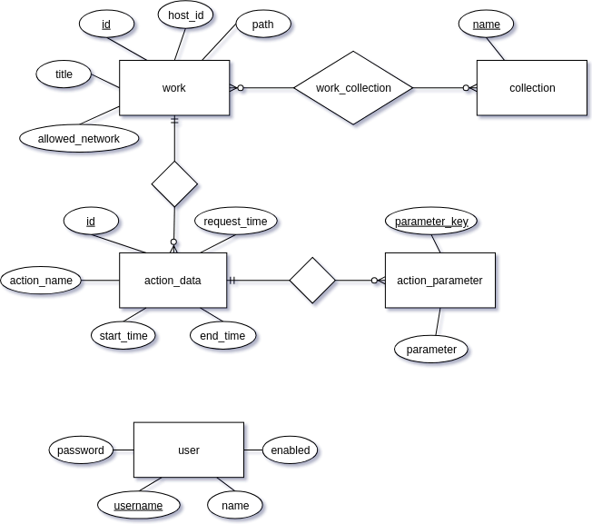

# Kitodo.Mediaserver Developer Guide

Kitodo.Mediaserver is a java project based on Spring Boot and Maven. It consists of six Maven modules:
* kitodo-mediaserver-cli
* kitodo-mediaserver-core
* kitodo-mediaserver-fileserver
* kitodo-mediaserver-importer
* kitodo-mediaserver-local
* kitodo-mediaserver-ui

The core module contains shared code and configuration files and is built as a simple jar. The importer module is also build as a simple jar and explicitly contains the code used for the import of works.

The fileserver and the ui are web applications based on Spring MVC and are built as war for deployment in servlet containers.

The cli module is a wrapper for command line executions such as import, clear-cache and perform-actions. It uses code from the core and importer modules and is built as an executable jar.

The local module is the place where to put local configurations and extensions and is thus empty in the main repository.

## Configuration files

*Basic configurations* are declared using YAML, hereto: [Configuration file](Configuration-file.md). The main configuration file is [default.yml](../kitodo-mediaserver-core/src/main/resources/config/default.yml). Any configuration parameter in this file can be overridden in [local.yml](../kitodo-mediaserver-local/src/main/resources/config/local.yml). The latter must be left empty in the repository, only to be used for local installations. Occasionally there are additional configurations in the application.yml of each module.

The system also allows a dev.yml to be used for developing puposes and a secrets.yml containing passwords and suchs to be deployed only on production servers. An example of a dev.yml using console logging and hibernate printouts looks like this:
```yml
spring:
  jpa:
    properties:
      hibernate:
        show_sql: true
        use_sql_comments: true
        format_sql: true

logging:
  path: /srv/kitodo/mediaserver/logs/
  level:
    org.springframework: INFO
    com.zaxxer.hikari: INFO
    org.hibernate: INFO
    org.kitodo: DEBUG
  pattern:
    console: "%d{yyyy-MM-dd HH:mm:ss:SSS} [%thread] %-5level %logger - %msg%n"
```

The read order of the configuration files is set in the `@SpringBootApplication` class of each executable module, see e.g. [FileserverApplication.java](../kitodo-mediaserver-fileserver/src/main/java/org/kitodo/mediaserver/fileserver/FileserverApplication.java). The embedding of the configuration parameter in the java code takes place in `@ConfigurationProperties` classes in the config directories of the modules. If you add a configuration parameter, you also have to extend the appropriate `@ConfigurationProperties` class.

*Spring configurations* (i.e. declarations of Spring Beans) are made in Java classes annotated with `@Configuration` placed in the config directory of the module. Of course you may also directly annotate Implementations as `@Component` or `@Service` making them directly accessible as Spring beans since component-scans are always made in the `@SpringBootApplication` classes.

## Actions

The concept of *actions* is central to the Mediaserver. Technically, an action is simply any implementation of the interface [IAction](../kitodo-mediaserver-core/src/main/java/org/kitodo/mediaserver/core/api/IAction.java) and thus anything, that could be performed on a work:

```java
public interface IAction {
    Object perform(Work work, Map<String, String> parameter) throws Exception;
}
```

Actions can be executed anywhere in the Kitodo.Mediaserver components: in the file server, using the admin ui, or at import before or after indexing (in fact, the indexing is an action itself) and they can also be ordered to be performed at a later time. Thus, e.g. at import, any number of actions can be perfomed before indexing of work (METS cleaning or extending actions, preproduction of thumbnails...), after succesful indexing (doi registration...), or requested to be performed later (creation of full work odf files ...).

Since actions are named beans, they can easily be added to the YAML configuration file to be executable in the different modules. This is implemented in the [ActionService](../kitodo-mediaserver-core/src/main/java/org/kitodo/mediaserver/core/services/ActionService.java). Requested actions to be performed at a later time are stored in a simple database (see the database model below) and performed using the CLI.

Requested actions are stored in a simple database where the action is always connected to a work and can have any number of parameters (see the database model below).

### Implementing actions

To implement a new action, you implement the [IAction](../kitodo-mediaserver-core/src/main/java/org/kitodo/mediaserver/core/api/IAction.java) interface. To make this action visible to Spring, you simply annotate it as a component and give it a unique name:

```java
@Component("myUniqueAction")
public class MyAction implements IAction {

    @Override
    public Object perform(Work work, Map<String, String> parameter) throws Exception {
        // do something
        return null;
    }
}
```

The action will then automatically be instantiated as a Spring bean and can be added in the configuration yaml using the name `myUniqueAction`.

It is encouraged to implement actions in the core module and make a pull request, so that they can be used by others as well. However, if you know your action can only be used locally, you may just as well put it in the local module.


### Implementing conversion classes

To implement a class for file conversion, you have to implement the [IConverter](../kitodo-mediaserver-core/src/main/java/org/kitodo/mediaserver/core/api/IConverter.java) interface. You will find implementation examples [here](../kitodo-mediaserver-core/src/main/java/org/kitodo/mediaserver/core/conversion).

You won't necessarily have to implement a new action for the conversion. For instance, if it is to be used for a single file, you can use the [SingleFileConvertAction](../kitodo-mediaserver-core/src/main/java/org/kitodo/mediaserver/core/actions/SingleFileConvertAction.java) and simply define a new Spring Bean with your conversion class in [FileserverConfiguration](../kitodo-mediaserver-fileserver/src/main/java/org/kitodo/mediaserver/fileserver/config/FileserverConfiguration.java) or wherever you wish to use the conversion.

## Database

ER-Model:



The database consists of just a few entities. The work table contains basic information on imported works and an enabled attribute for controlling access to the files of a work. The tables action_data and action_parameter are for controlling asynchronous actions to be performed on works. The user table contains the login data of the users of the UI. Since the mediaserver UI is strictly for administration, we don't need a user role concept.

The implementation of the database and all database communication uses Spring JPA, all classes are found [here](../kitodo-mediaserver-core/src/main/java/org/kitodo/mediaserver/core/db).
The initialization and update of the database is done using Flyway, thus only MySQL is supported for the time being. The Flyway migration SQL files are found [here](../kitodo-mediaserver-core/src/main/resources/db/migration/mysql). See [UpdateDbCommand](../kitodo-mediaserver-cli/src/main/java/org/kitodo/mediaserver/cli/commands/UpdateDbCommand.java). To update the database, you must execute the cli with param `updatedb`.

For further information, see [#132](https://github.com/tuub/kitodo-mediaserver/issues/132).

## Notifications

The Kitodo.Mediaserver contains a system for creating and sending email notifications. To add notifications to the code, use the following:

```java
// Class scope
@Autowired
private ObjectFactory<Notifier> notifierFactory;

// Method scope
Notifier notifier = notifierFactory.getObject();
```

The implemented `send` method expects also a `List<String>` parameter, which 
could be defined in the properties of a module:

```yaml
reportNotificationsEmail:
  - reports@example.org
errorNoticationsEmail:
  - tickets@example.org
  - errors@example.org
  
```

## Coding Guidelines
The [Kitodo coding guidelines](http://www.kitodo.org/fileadmin/groups/kitodo/Dokumente/Kitodo_Developer_Guidelines_2017-06.pdf) are to be followed. The Kitodo [checkstyle.xml](../checkstyle.xml) is activated at build using the maven-checkstyle-plugin.
We also use the following additions.

### Usage of GitHub and Issues
All changes and extensions of the code should be defined in GitHub issues. It is encouraged to supply the issues with further comments and discussions to serve as documentation of the code. Any commit message should always contain a reference to the GitHub issue in question. In general there should be only one issue to one commit and one pull request.

### Java 8 Stream API
The use of the Stream API is encouraged. It is however important, that the code is formatted in a way to be easy to read. Every stream operation should thus be on a new line.

Wrong:
```java
List<String> result = Arrays.stream(resultArray).map(String::trim).filter(item -> !item.isEmpty()).collect(Collectors.toList());
```

Correct:
```java
List<String> result = 
    Arrays.stream(resultArray)
    .map(String::trim)
    .filter(item -> !item.isEmpty())
    .collect(Collectors.toList());
```

### Autowire
Spring `@Autowired` annotation is preferably to be used on setters, not on variables directly.

### Variables
Variables should have speaking names, no abbreviations.
