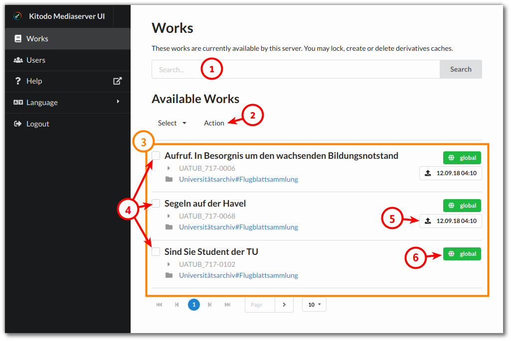

Kitodo.Mediaserver UI is an optional Web administration tool.

## Prerequisites

* A modern web browser (as of the release date of your Mediaserver version)
* Javascript enabled

## Login

Open the URL of you UI installation in a web browser. UI is installed with a default user **admin** with password **admin**. You should change the password immediately after your first login.

## Works management

After login you get redirected to the works overview. There you'll find all imported works.

### (1) Search field

Search for works in different fields. Hover the mouse cursor over the field to see which fields are searchable explicitly. Without a specific field like `id:UAB` search is performed on every field. Search for values in fields using operators:
- `field=abc` - is exactly "abc"
- `field:abc` - contains "abc" (like "\*abc\*")
- `field!=abc` - is not "abc"
- `field!:abc` - does not contain "abc"
- `field<abc` - less than "abc" (best for numeric IDs or indexTime)
- `field<=abc` - less than or equal to "abc"
- `indexTime=""` - indexTime is NULL (never indexed)

### (2) Perform action

The Action dropdown button allows to perform any available action on the selected (3) works like clearing their derivatives files cache. Not all actions are available for multiple works.

### (3) Works overview

The works overview shows the works found. Only successfully imported works are shown here. The first line of an work item shows the work title. The second line is the work ID.

### (4) Works selection

Select one or more works to perform actions on them.

### (5) Last index time

When you publish works to your Viewer (like Kitodo.Presentation) you can trigger a remote indexing job. This time stamp shows the last successfully performed indexing call.

### (6) Network restrictions

By default every work can be accessed globally (network "global"). You can disable a work here (network "disabled"). If you have configured further networks, you can choose them here for a single work. See [Configuration file (allowedNetworks)](Configuration-file.md) for more.

## User management

The user management allows to add, edit and remove users. You may change any users password here too. Every user has full access to the UI. There are no granular access rights. And these users are not used by the core Mediaserver.
